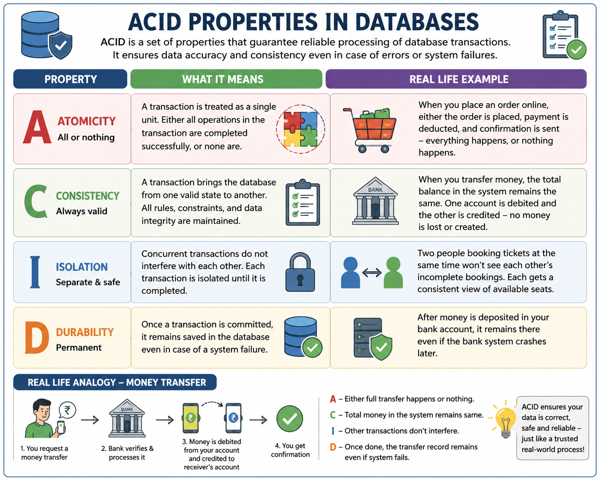

# ACID Properties in Databases

> **ACID properties are the foundation of reliable database transactions.**  
> They ensure that data remains accurate, consistent, isolated, and safe—even when errors, concurrent transactions, or system failures occur.




## What is ACID?

**ACID** stands for:

- **A — Atomicity**
- **C — Consistency**
- **I — Isolation**
- **D — Durability**

Together, these four properties ensure that database transactions are processed reliably.


## 1. Atomicity — All or Nothing

**Atomicity** means that a transaction is treated as one complete unit.

Either **all operations succeed**, or **none of them are applied**.

### Real-life example

Imagine transferring ₹1,000 from Account A to Account B:

1. ₹1,000 is deducted from Account A.
2. ₹1,000 is credited to Account B.

If the system fails after deducting the money but before crediting Account B, the transaction should be rolled back.

**Result:** Either the complete transfer happens, or nothing happens.


## 2. Consistency — Always Valid

**Consistency** ensures that a transaction takes the database from one valid state to another valid state.

All database rules, constraints, and integrity requirements must remain satisfied.

### Real-life example

If Account A has ₹10,000 and transfers ₹2,000 to Account B:

- Account A becomes ₹8,000.
- Account B increases by ₹2,000.
- The total money involved remains correct.

The database must not end up with invalid or missing data.


## 3. Isolation — Transactions Work Independently

**Isolation** ensures that multiple transactions running at the same time do not incorrectly interfere with each other.

Each transaction should behave as if it is executing independently.

### Real-life example

Imagine two customers trying to book the **last available movie ticket** at exactly the same time.

The database must prevent both customers from successfully purchasing the same seat.

One transaction gets the seat, while the other receives an appropriate response that the seat is no longer available.


## 4. Durability — Once Committed, It Stays

**Durability** means that once a transaction has been successfully committed, its changes are permanently stored.

Even if the database server crashes immediately afterward, committed data should not be lost.

### Real-life example

You deposit ₹5,000 into your bank account and receive confirmation.

Even if the banking system crashes a few seconds later, the ₹5,000 deposit should still exist when the system comes back online.


## 💳 One Simple Example: Money Transfer

Consider a bank transfer:

```text
Account A
   │
   │  Transfer ₹1,000
   ▼
Database Transaction
   │
   ├── Debit ₹1,000 from A
   │
   └── Credit ₹1,000 to B
   │
   ▼
COMMIT
   │
   ▼
Transfer Completed
```

The ACID properties protect this transaction:

| Property | What it guarantees |
|---|---|
| **Atomicity** | The complete transfer happens or none of it happens. |
| **Consistency** | Database rules and balances remain valid. |
| **Isolation** | Other transactions do not see incorrect intermediate results. |
| **Durability** | Once committed, the transfer remains saved. |


## 🧠 Easy Way to Remember ACID

> **A — All or Nothing**  
> **C — Correct and Consistent**  
> **I — Independent Transactions**  
> **D — Data Stays**


## 🔧 ACID in SQL Server

In SQL Server, transactions can be controlled using commands such as:

```sql
BEGIN TRANSACTION;

UPDATE Accounts
SET Balance = Balance - 1000
WHERE AccountID = 101;

UPDATE Accounts
SET Balance = Balance + 1000
WHERE AccountID = 202;

COMMIT TRANSACTION;
```

If something goes wrong, the transaction can be rolled back:

```sql
ROLLBACK TRANSACTION;
```

A common production pattern is:

```sql
BEGIN TRY
    BEGIN TRANSACTION;

    -- Transactional operations

    COMMIT TRANSACTION;
END TRY
BEGIN CATCH
    IF @@TRANCOUNT > 0
        ROLLBACK TRANSACTION;

    THROW;
END CATCH;
```


## 🎯 Why ACID Matters

Without ACID properties, databases could potentially experience:

- Lost or duplicated data
- Incorrect account balances
- Partial transactions
- Conflicting updates
- Data corruption after failures
- Unreliable application behavior

ACID provides the foundation for **trustworthy transactional systems** such as banking, e-commerce, payment processing, order management, and many enterprise applications.


## 📌 Quick Summary

```text
                ACID
                 │
       ┌─────────┼─────────┐
       │         │         │
       A         C         I         D
       │         │         │         │
   All or      Valid     Separate   Permanent
   Nothing     State     Transactions Data
```

### Final Thought

Understanding ACID is not just about remembering four database terms.  
It is about understanding **how databases protect business-critical data when things go wrong.**


# 🚀 Keep Learning. Keep Building. Keep Growing.

> **“Every database you troubleshoot makes you better. Every problem you solve makes you stronger. Keep learning—your expertise is built one transaction at a time.”**

**Happy Learning! 📚💻**
